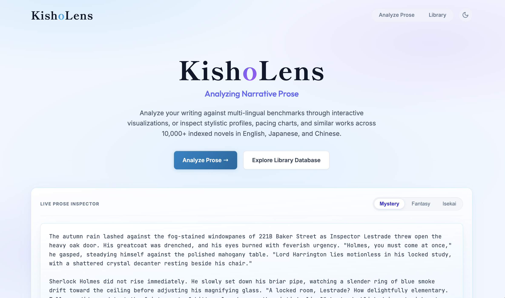
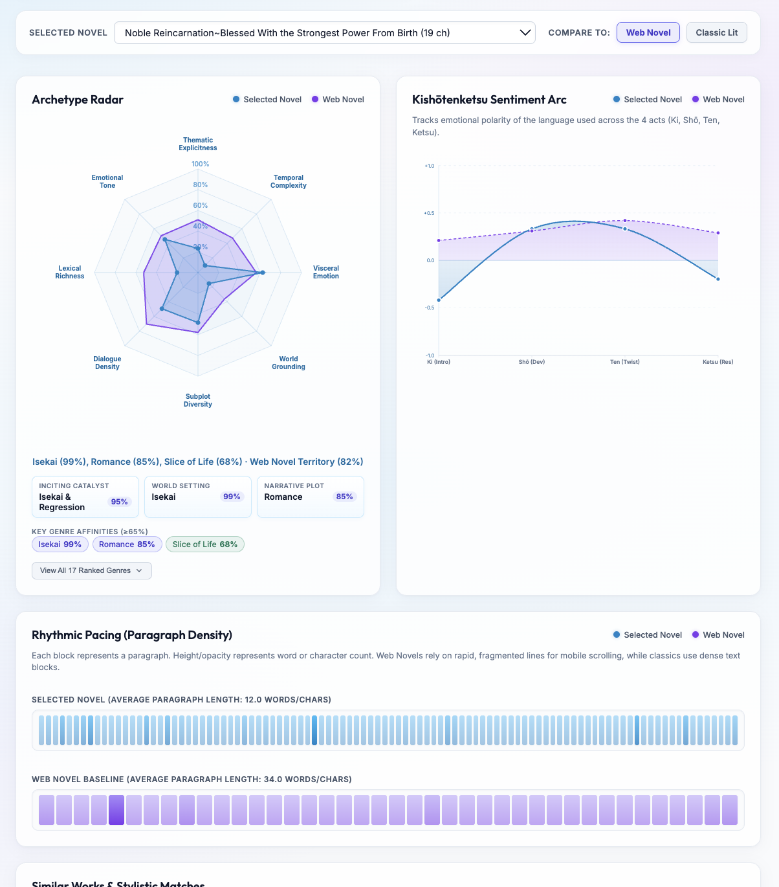
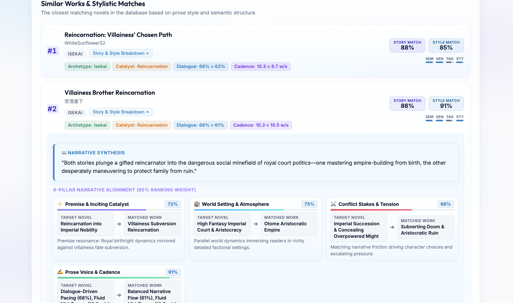
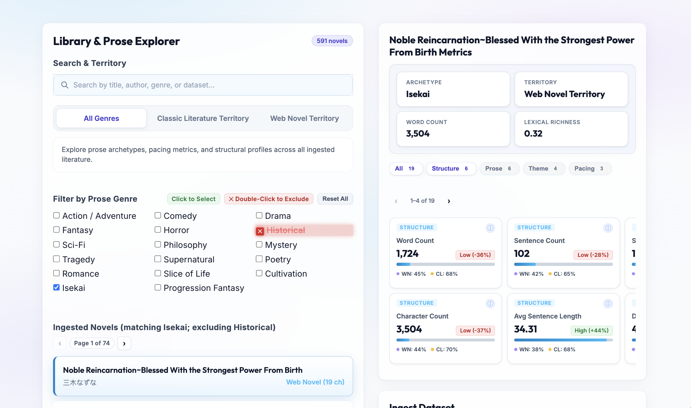

# KishoLens

A computational stylometry and narrative similarity platform for web fiction and classical literature. KishoLens analyzes sentence structure, dialogue cadence, vocabulary richness, and structural pacing across 10,000+ works in English, Japanese, and Chinese.

[Live Demo](https://kisholens.pages.dev)

---

## Interface & Visualizations

<div align="center">
  
</div>

<br/>

| Archetype Radar & Pacing Barcode | 4-Pillar Narrative Alignment Drawer |
|:---:|:---:|
|  |  |

<br/>

<div align="center">
  
</div>

---

## Key Features

- **37-Metric Multi-Lingual Stylometry**: Native syntax parsing and lexical analysis across English (`spaCy`, `VADER`), Japanese (`SudachiPy`, `Oseti`), and Chinese (`spaCy`) covering sentence structure, dialogue density, vocabulary richness (TTR), and somatic sentiment.
- **Explainable Similarity Engine (< 2ms)**: Vectorized NumPy search combining 384D semantic embeddings with 8D prose fingerprints, generating 4-pillar narrative alignments (*Catalyst, Setting, Conflict, Cadence*) and side-by-side metric diffs across 10,320 works.
- **Interactive Visualizations**: 8-axis archetype radar charts with territory baseline overlays, 100-bar chapter pacing barcodes, and 4-phase *Kishōtenketsu* quantile sentiment arcs.
- **Live Prose Analyzer & Library Explorer**: Real-time analysis of custom input prose alongside a searchable 10,320-novel library with multi-genre inclusion/exclusion filtering and session state persistence.

---

## Architecture & Tech Stack

- **Frontend**: Astro 5, TypeScript, Vanilla CSS design tokens, HTML5 Canvas API (hosted on Cloudflare Pages)
- **Backend API**: FastAPI, Uvicorn, Python 3.11+ (deployed on Google Cloud Run)
- **NLP & Stylometry**: spaCy (`en_core_web_sm`, `zh_core_web_sm`), NLTK (VADER), SudachiPy, Oseti
- **Embeddings & ML**: Sentence-Transformers (`all-MiniLM-L6-v2`), NumPy, SciPy
- **Data Storage**: SQLite (`novel_stats.sqlite`), pre-computed JSON metadata, Cloudflare R2 object storage
- **Package Management**: Astral `uv` (Python), `npm` (Node.js)

---

## Local Setup

### Requirements
- Python 3.10+ (with `uv` recommended)
- Node.js 18+

### 1. Installation

```bash
# Clone the repository
git clone https://github.com/Jonathan-Luo01/KishoLens.git
cd KishoLens

# Install Python dependencies and NLP models
uv sync --extra nlp
uv run python -m spacy download en_core_web_sm
uv run python -m spacy download zh_core_web_sm

# Install frontend dependencies
npm --prefix frontend install
```

### 2. Running Locally

Start both the backend and frontend concurrently:

```bash
npm run dev
```

Or run them individually:

```bash
# Backend (FastAPI on http://localhost:8000)
uv run uvicorn kisholens.api.main:app --reload --port 8000

# Frontend (Astro on http://localhost:4321)
npm --prefix frontend run dev
```

---

## API Reference

The FastAPI service exposes the following core endpoints:

| Method | Endpoint | Description |
|---|---|---|
| `GET` | `/health` | Service health status and loaded database diagnostics |
| `GET` | `/api/novels` | List indexed novels with genre, source, and territory filters |
| `GET` | `/api/novels/{id}/stats` | Full 37-metric profile, radar vector, pacing array, and top matches |
| `GET` | `/api/novels/{id}/arc` | 4-act Kishōtenketsu sentiment trajectory and quantile ranges |
| `POST` | `/api/analyze` | Real-time analysis of custom input prose |
| `GET` | `/api/db/stats` | Aggregated dataset counts and source distributions |
| `POST` | `/api/pipeline/ingest` | Trigger background scraping & ETL pipeline for new novels |
| `GET` | `/api/pipeline/jobs/{id}` | Ingestion job progress and completion status |

### Example: Analyze Custom Prose

```bash
curl -X POST "http://localhost:8000/api/analyze" \
     -H "Content-Type: application/json" \
     -d '{
       "text": "The wind howled across the stone fortress as Duke Jeffrey unsheathed his blade...",
       "lang": "en"
     }'
```

---

## Testing

```bash
# Run backend test suite
uv run pytest

# Test frontend build
npm --prefix frontend run build
```

---

## Project Structure

```
KishoLens/
├── kisholens/              # Python backend package
│   ├── api/                # FastAPI application and route handlers
│   ├── ml/                 # Stylometric features, embeddings, similarity engine
│   ├── pipeline/           # Ingestion, scrapers, and ETL scripts
│   └── storage/            # Cloudflare R2 backup and storage utilities
├── frontend/               # Astro frontend application
│   ├── src/pages/          # Library explorer, prose analyzer, visualizer
│   └── src/styles/         # Design tokens, theme styling (Dark / Light)
├── data/                   # Precomputed SQLite databases and metadata
│   ├── novel_stats.sqlite  # Compact precalculated stats for all 10,320 novels
│   ├── novels_metadata.json# Index of titles, authors, genres, and chapter counts
│   └── vector_cache.json   # 8D stylometric fingerprint vectors
├── scripts/                # Ingestion and similarity recomputation scripts
└── tests/                  # Backend pytest test suite
```

---

## Privacy & Data Retention

KishoLens is designed with privacy-first principles:
- **Zero Server-Side Text Storage**: User-submitted prose sent to `/api/analyze` is processed purely in-memory in real time for stylometric feature extraction and is never logged, saved, or persisted on backend servers or databases.
- **Local Persistence Only**: Any draft text or session settings stored in the web application reside exclusively within your browser's local storage (`localStorage`) and never leave your machine.

---

## License & Dataset Notes

This project is licensed under the [MIT License](LICENSE).

Raw scraped text from web platforms is subject to copyright by respective authors and is excluded from the repository. All statistical metrics, Gutenberg public domain data, and embeddings are provided for non-commercial research and educational use.
