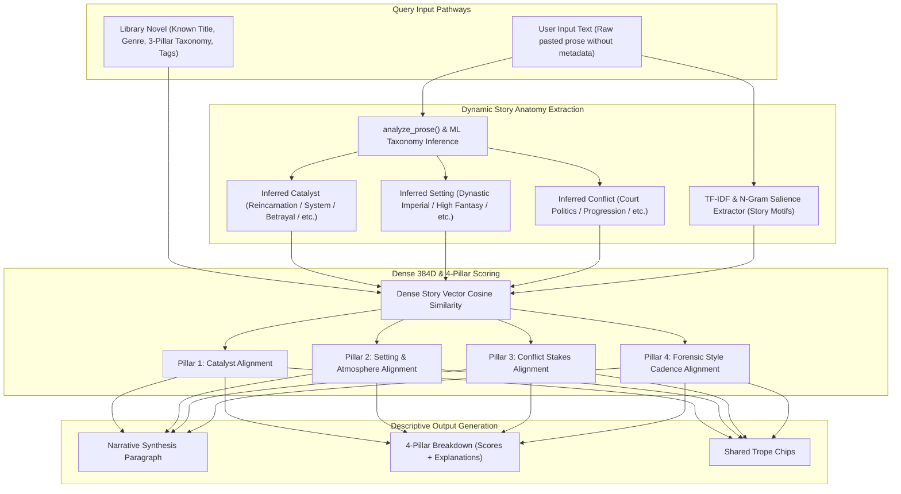

# Descriptive Story Similarity Engine & 4-Pillar Narrative Alignment Design

- **Date:** 2026-08-17
- **Topic:** Descriptive Story Similarity Reasoning & 4-Pillar Narrative Alignment Engine
- **Status:** Approved / In Design

---

## 1. Overview & Goals

KishoLens pairs literary works using a story-dominant similarity engine (85% Story Anatomy & Thematic Embedding, 15% Forensic Prose Style). 

This design upgrades the similarity reasoning engine from generic one-line badges into a **Hybrid Descriptive Story Reasoner** that produces:
1. A cohesive, human-readable **Narrative Synthesis Paragraph** explaining the thematic, premise, and conflict alignment between the query and candidate.
2. A **4-Pillar Narrative Alignment Matrix** with individual scores and explicit comparative explanations for:
   - **Pillar 1: Premise & Inciting Catalyst** (e.g. *Reincarnation into elite nobility with supreme power*)
   - **Pillar 2: World Setting & Atmosphere** (e.g. *Dynastic Imperial court with high political stakes*)
   - **Pillar 3: Conflict Stakes & Tension** (e.g. *Succession rivalries, aristocratic power struggles, concealed identity*)
   - **Pillar 4: Forensic Prose Voice & Cadence** (e.g. *Dialogue-dense, fast-paced scene cadence*)
3. **Shared Trope & Keyword Chips** highlighting specific matching motifs (*Overpowered MC, Secret Identity, Court Intrigue*).
4. **Universal Compatibility**: Works identically for:
   - **Database Novels** (with known title, 3-pillar taxonomy, and tags)
   - **Raw User Input Text** in `/analyze` (where title/synopsis may be missing, dynamically inferring 3-pillars and salient motifs on the fly).

---

## 2. Architecture & Data Flow



---

## 3. Data Schema & API Contract

Every candidate returned by `find_top_matches()` in `/api/novels/{novel_id}/stats` and `/api/analyze` will include the enhanced `narrative_reasoning` payload:

```json
{
  "id": 245,
  "title": "Reincarnation: Villainess’ Chosen Path",
  "author": "WhiteSunflowerS2",
  "genre": "Isekai",
  "territory": "Web Novel Territory",
  "similarity_score": 0.8189,
  "story_similarity": 81,
  "style_similarity": 85,
  "narrative_reasoning": {
    "narrative_synthesis": "Both stories share a high-stakes Reincarnation premise set within an aristocratic court, centering on an overpowered protagonist navigating covert political rivalries and concealing their supreme innate power.",
    "pillars": {
      "catalyst": {
        "name": "Premise & Inciting Catalyst",
        "score": 0.88,
        "query_val": "Reincarnation",
        "cand_val": "Reincarnation / Noble Lineage",
        "explanation": "Shared opening spark: Both narratives begin with the protagonist being reborn into high aristocracy with extraordinary latent abilities."
      },
      "setting": {
        "name": "World Setting & Atmosphere",
        "score": 0.82,
        "query_val": "Dynastic Imperial",
        "cand_val": "High Fantasy Imperial Court",
        "explanation": "Shared atmosphere: Aristocratic court with rigid class hierarchy and political maneuvering."
      },
      "conflict": {
        "name": "Conflict Stakes & Tension",
        "score": 0.85,
        "query_val": "Court Politics",
        "cand_val": "Succession & Aristocratic Intrigue",
        "explanation": "Shared core tension: Navigating factional power struggles while concealing true capabilities."
      },
      "style_cadence": {
        "name": "Prose Voice & Cadence",
        "score": 0.78,
        "query_val": "Dialogue-Dense (68%), 10.3 w/s",
        "cand_val": "Dialogue-Dense (79%), 13.2 w/s",
        "explanation": "Comparable rapid dialogue pacing and dynamic scene rhythm."
      }
    },
    "shared_tropes": ["Reincarnation", "Overpowered MC", "Secret Identity", "Court Intrigue"]
  },
  "match_badges": [...],
  "metric_comparisons": [...]
}
```

---

## 4. Synthesis Generation Engine

In `kisholens/ml/similarity.py`:

1. **`_infer_query_anatomy(query_text, query_semantic, query_features)`**:
   - Safely extracts or infers:
     - `catalyst`: From `taxonomy.inciting_event.primary` or raw text regex/anchor detection.
     - `setting`: From `taxonomy.world_setting.primary` or raw text world classification.
     - `conflict`: From `taxonomy.narrative_plot.primary` or raw text plot conflict classification.
     - `motifs`: Salient story n-grams extracted from text or candidate tags.
2. **`_generate_narrative_synthesis(q_anatomy, c_anatomy, s_sim, g_sim, is_user_input)`**:
   - Synthesizes a cohesive 1-2 sentence narrative explanation comparing the query and candidate themes.
3. **`_compute_4pillar_breakdown(q_anatomy, c_anatomy, q_metrics, c_metrics, sem_sim, g_sim, sty_sim)`**:
   - Calculates 4 individual pillar scores and generates crisp, context-specific comparative explanations.
4. **`_extract_shared_tropes(q_anatomy, c_anatomy)`**:
   - Identifies overlapping trope keywords and returns a formatted list.

---

## 5. Frontend Visual Drawer Implementation

In `frontend/src/pages/library.astro` and `frontend/src/pages/analyze.astro`:

1. **Narrative Synthesis Card**:
   - Rendered as a prominent callout with an accent border and custom glassmorphism.
2. **4-Pillar Alignment Grid**:
   - 3 Story Pillar micro-cards + 1 Style Cadence micro-card, with mini score bars and mapping values (`Query ➔ Candidate`).
3. **Shared Trope Pills**:
   - Indigo/Violet pills highlighting matching micro-tropes.
4. **Forensic Cadence Drawer Section**:
   - Retains the side-by-side metric comparison table (Dialogue %, Cadence, TTR, Visceral Imagery, Thematic Explicitness).

---

## 6. Verification & Test Suite

1. **Unit Tests** (`tests/ml/test_descriptive_similarity.py`):
   - Test reasoning generation for library novel queries.
   - Test dynamic inference and reasoning for raw text inputs without metadata.
   - Verify pillar score bounds and safe fallbacks.
2. **Live Browser Verification**:
   - Inspect drawer visual appearance on `/library` and `/analyze`.
   - Verify dark mode and light mode contrast.
